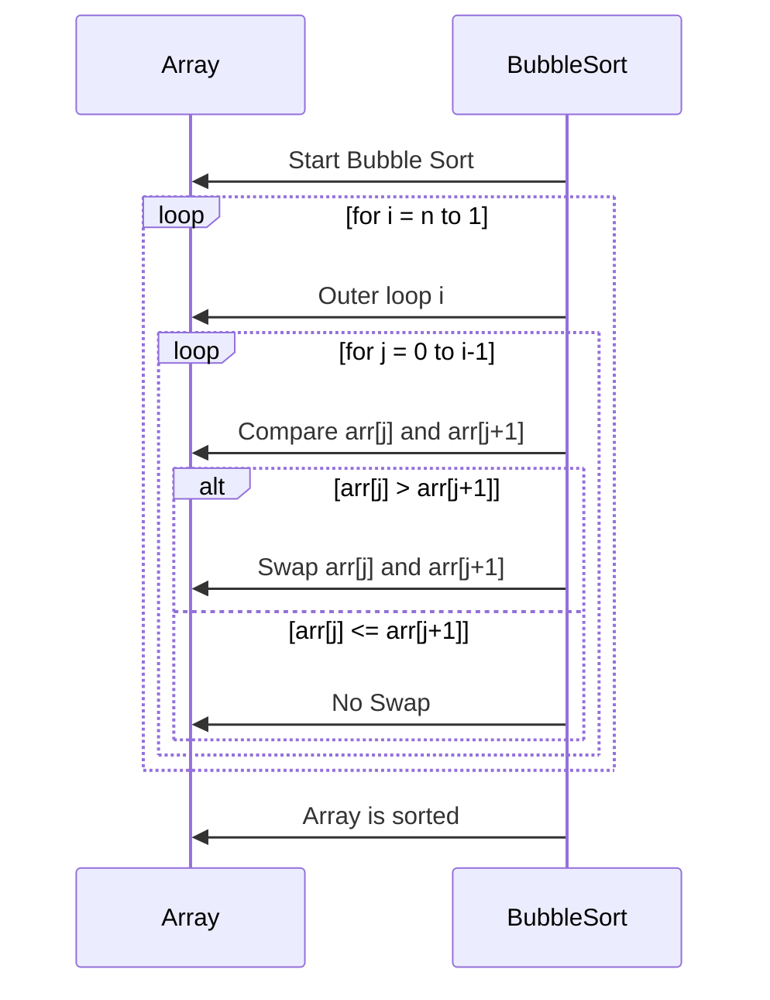

# 2 — sorting

This section introduces simple algorithms, their analysis, and the process of designing them.

## 2.1 Bubble sort

See this repo's [cpp implementation](../src/sorting/bubble_sort.cpp)

Bubble sort is one of the simplest sorting algorithms. 
It repeatedly compares adjacent elements and swaps them if they are in the wrong order. 
Each pass "bubbles up" the largest element to its correct position at the end of the array.

Bubble sort is rarely used in practice but is a great educational tool for being introduced to sorting algorithms due to its simplicity.



**Properties**
- Stable: Equal elements retain their relative order.
- In-place: Requires no extra memory beyond a few variables.
- Adaptive: With an early-exit optimization, best case becomes O(n).

**Complexity**
- Best case: O(n) (already sorted, with early exit)
- Worst case: O(n²)
- Average case: O(n²)
- Space complexity: O(1)

## 2.2 Insertion Sort

See this repo's [cpp implementation](../src/sorting/insertion_sort.cpp)

- A simple, intuitive sorting algorithm.
- Works the way people often sort playing cards:
  - Start with the second card.
  - Insert it into its correct position relative to the first.
  - Continue until all cards are sorted.

### Pseudocode (CLRS style)

```
INSERTION-SORT(A)
for j = 2 to A.length
key = A[j]
i = j - 1
while i > 0 and A[i] > key
A[i + 1] = A[i]
i = i - 1
A[i + 1] = key
```

### Time Complexity
- Best case: **O(n)** (already sorted)
- Worst case: **O(n²)**
- Average case: **O(n²)**
- Space: **O(1)** (in-place)

## 2.3 Analyzing Algorithms

- **Running time** depends on input size `n`.
- We estimate the number of *primitive operations* (comparisons, assignments).
- Use **asymptotic analysis** (Big-O, Θ, Ω) to compare growth rates.

## 2.4 Designing Algorithms

- Key strategies include:
  - **Divide and Conquer**
  - **Dynamic Programming**
  - **Greedy Methods**
- These form the foundation for the rest of this repo and computer science algorithms in general.

## Key Takeaways

- Insertion Sort is easy to implement and efficient for small arrays.
- Algorithm analysis allows fair comparison independent of hardware.
- Early chapters build the foundation for advanced algorithm design.