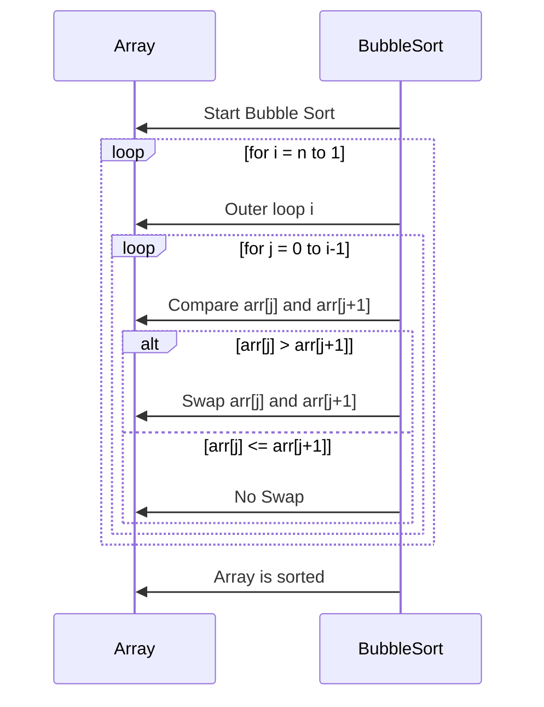
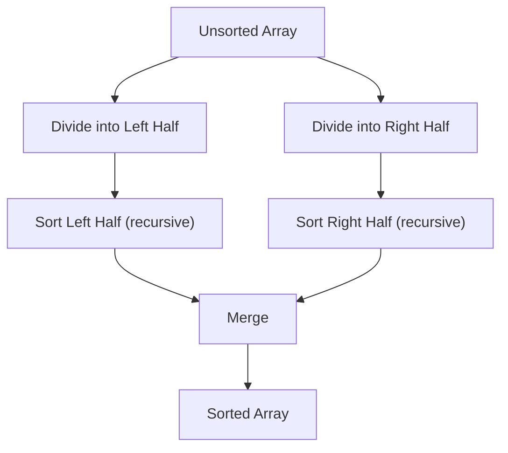
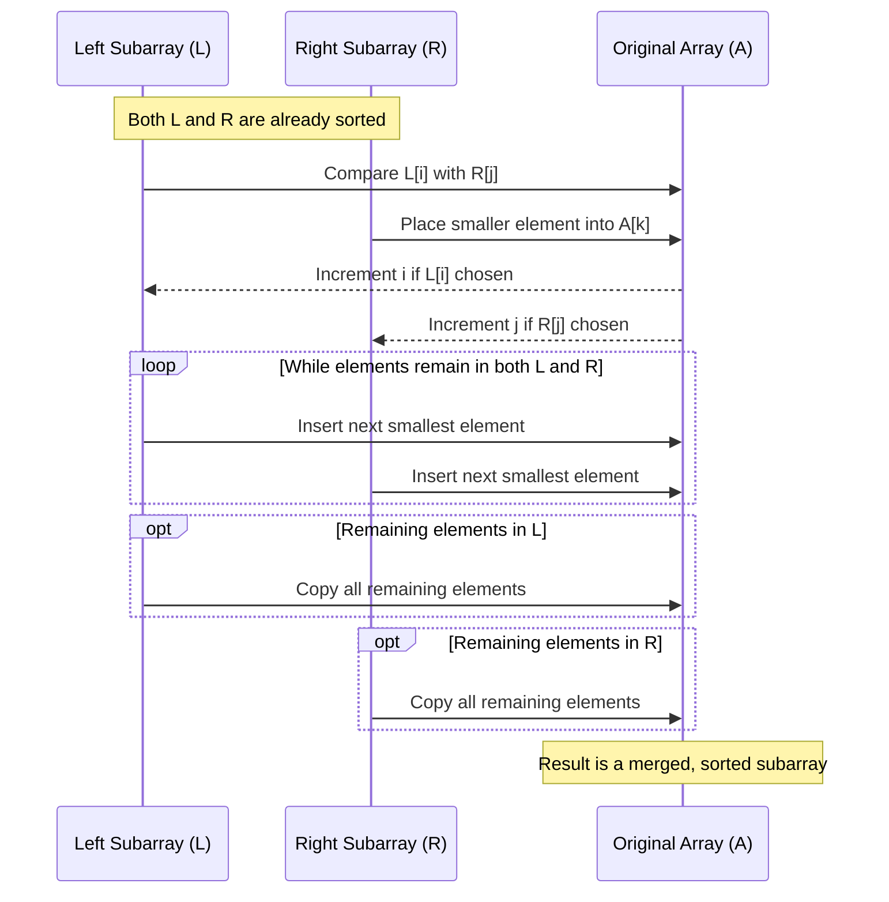

- [2 — Sorting](#2--sorting)
  - [2.1 Bubble sort](#21-bubble-sort)
    - [Diagram](#diagram)
    - [Properties and Time Complexity](#properties-and-time-complexity)
  - [2.2 Insertion Sort](#22-insertion-sort)
    - [Without Templates](#without-templates)
      - [Pseudocode (CLRS style)](#pseudocode-clrs-style)
    - [With Templates](#with-templates)
    - [Properties and Time Complexity](#properties-and-time-complexity-1)
  - [2.3 Merge sort](#23-merge-sort)
    - [Diagrams](#diagrams)
    - [Properties and Time Complexity](#properties-and-time-complexity-2)
  - [2.4 Analyzing Algorithms](#24-analyzing-algorithms)
  - [2.5 Designing Algorithms](#25-designing-algorithms)
  - [Key Takeaways](#key-takeaways)
  - [Sorting Table](#sorting-table)

# 2 — Sorting

This section introduces simple algorithms, their analysis, and the process of designing them.

## 2.1 Bubble sort

See this repo's cpp implementation for [bubble sort](../src/sorting/bubble_sort.cpp)

Bubble sort is one of the simplest sorting algorithms. 
It repeatedly compares adjacent elements and swaps them if they are in the wrong order. 
Each pass "bubbles up" the largest element to its correct position at the end of the array.

Bubble sort is rarely used in practice but is a great educational tool for being introduced to sorting algorithms due to its simplicity.

### Diagram



### Properties and Time Complexity
- Stable: Equal elements retain their relative order.
- In-place: Requires no extra memory beyond a few variables.
- Adaptive: With an early-exit optimization, best case becomes O(n).

- Best case: **O(n)** (already sorted, with early exit)
- Worst case: **O(n²)**
- Average case: **O(n²)**
- Space complexity: **O(1)**

## 2.2 Insertion Sort

### Without Templates

See this repo's cpp implementation for [insertion sort](../src/sorting/insertion_sort.cpp)

- A simple, intuitive sorting algorithm.
- Works the way people often sort playing cards:
  - Start with the second card.
  - Insert it into its correct position relative to the first.
  - Continue until all cards are sorted.

#### Pseudocode (CLRS style)

```
INSERTION-SORT(A)
for j = 2 to A.length
key = A[j]
i = j - 1
while i > 0 and A[i] > key
A[i + 1] = A[i]
i = i - 1
A[i + 1] = key
```

### With Templates

See this repo's cpp implementation for [insertion sort](../include/algorithms/sorting.hpp) using templates.

- The function is a template, so it can work with any type of iterator (vectors, lists, arrays, etc.).
- Implements insertion sort, a simple comparison-based sorting algorithm.
- Sorts the elements in-place in ascending order.
- Works with random-access iterators or bidirectional iterators, examples:
  - std::vector
  - std::list
  - std::array
  - std::deque
  - std::string
  - std::span (C++20)
- Fails with forward-only iterators and containers with const iterators, examples:
  - std::set
  - std::map

### Properties and Time Complexity
- Best case: **O(n)** (already sorted)
- Worst case: **O(n²)**
- Average case: **O(n²)**
- Space: **O(1)** (in-place)

## 2.3 Merge sort

See this repo's cpp implementation for [merge sort](../src/sorting/merge_sort.cpp)

Merge Sort is a classic **divide-and-conquer** sorting algorithm.  
It works by recursively splitting an array into halves until each subarray contains a single element, and then merging the subarrays back together in sorted order.  

### Diagrams



The key step in merge sort is the **merge** procedure, which takes two sorted subarrays and combines them into a single sorted array.



### Properties and Time Complexity

- Best case: **O(n log n)**
- Worst case: **O(n log n)**
- Average case: **O(n log n)**
- Space: **O(n)**
- Stable: **Yes**

## 2.4 Analyzing Algorithms

- **Running time** depends on input size `n`.
- We estimate the number of *primitive operations* (comparisons, assignments).
- Use **asymptotic analysis** (Big-O, Θ, Ω) to compare growth rates.

## 2.5 Designing Algorithms

- Key strategies include:
  - **Divide and Conquer**
  - **Dynamic Programming**
  - **Greedy Methods**
- These form the foundation for the rest of this repo and computer science algorithms in general.

## Key Takeaways

- Insertion Sort is easy to implement and efficient for small arrays.
- Algorithm analysis allows fair comparison independent of hardware.
- Early chapters build the foundation for advanced algorithm design.

## Sorting Table

| Algorithm      |        Worst Case       |    Average Case    |
| :------------- | :---------------------: | -----------------: |
| Insertion sort | $\mathcal{O}(n^2)$      | $\Theta(n^2)$      |
| Merge sort     | $\mathcal{O}(nlog(n))$  | $\Theta(nlog(n))$  |
| Heapsort       | $\mathcal{O}(nlog(n))$  | -                  |
| Quicksort      | $\mathcal{O}(n^2)$      | $\Theta(nlog(n))$  |
| Counting sort  | $\mathcal{O}(k + n)$    | $\Theta(k + n)$    |
| Radix sort     | $\mathcal{O}(d(n + k))$ | $\Theta(d(n + k))$ |
| Bucket sort    | $\mathcal{O}(n^2)$      | $\Theta(n)$        |